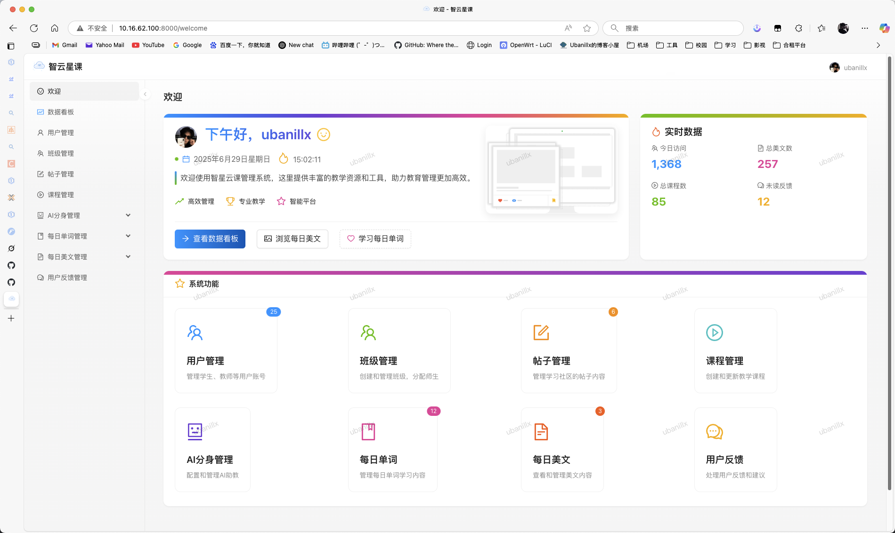
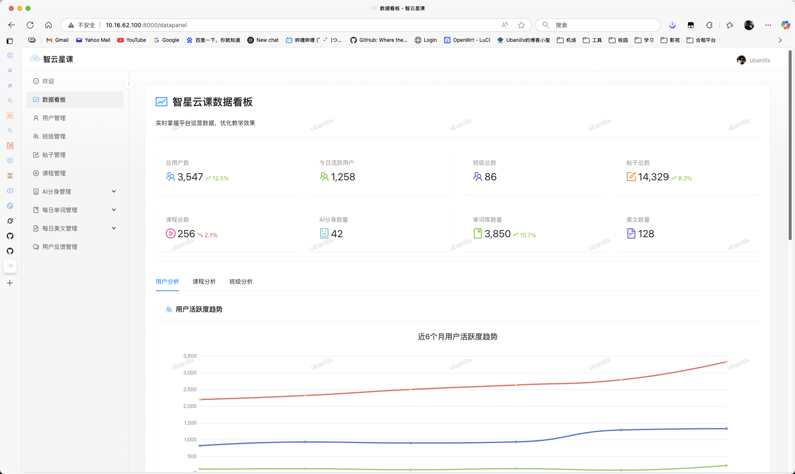
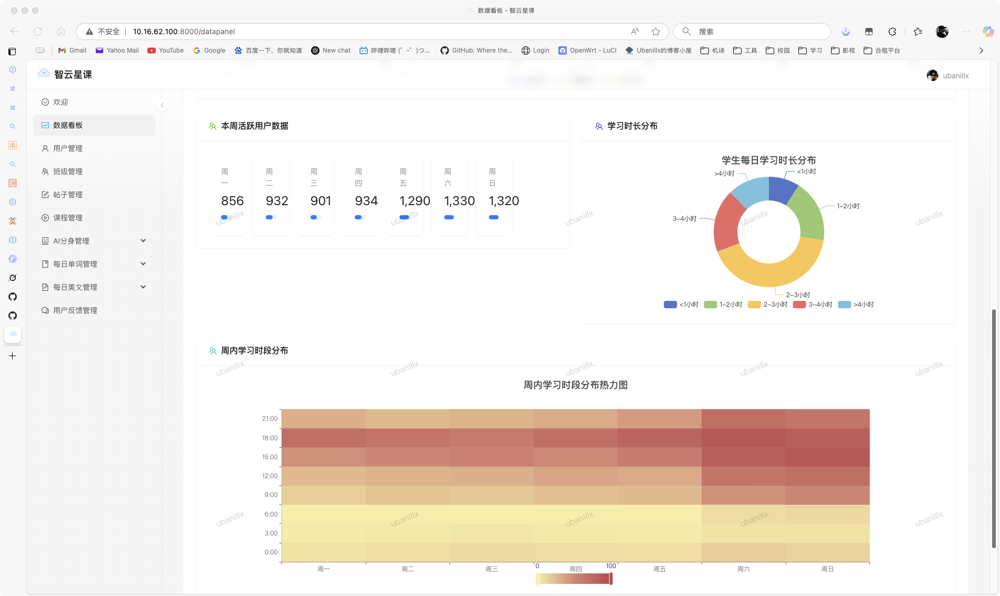
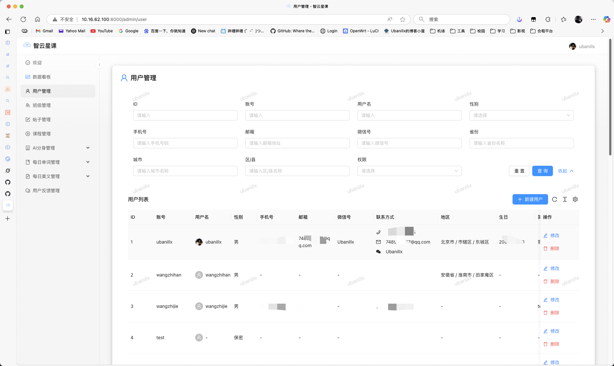
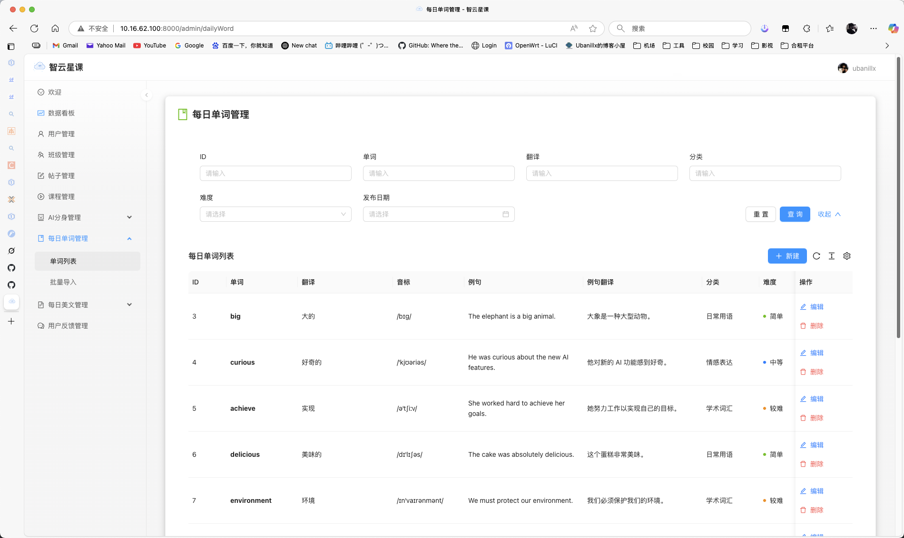
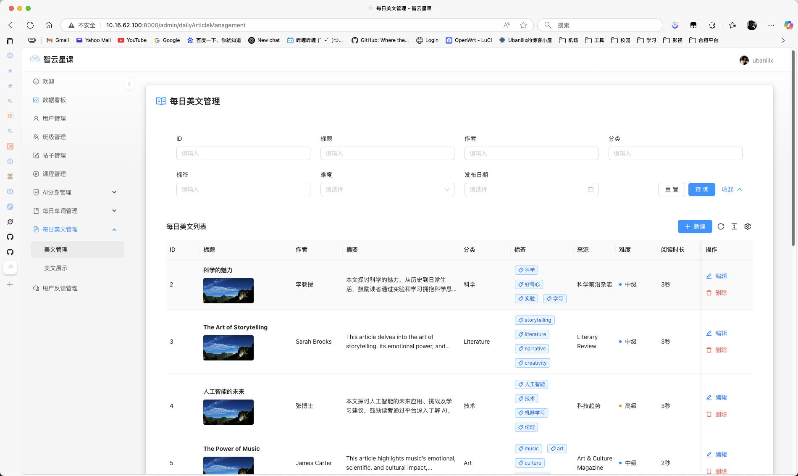
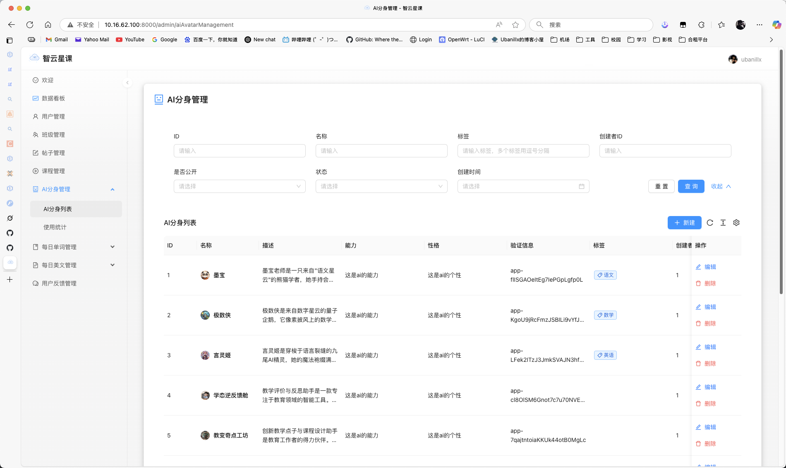
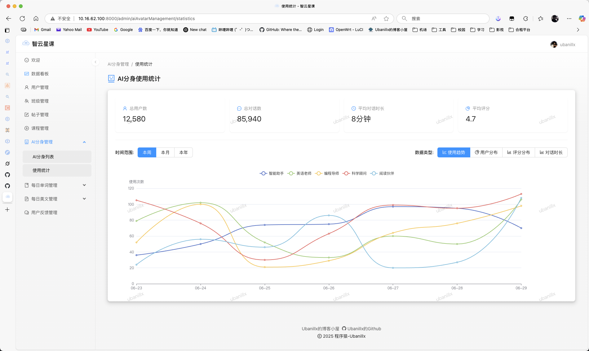
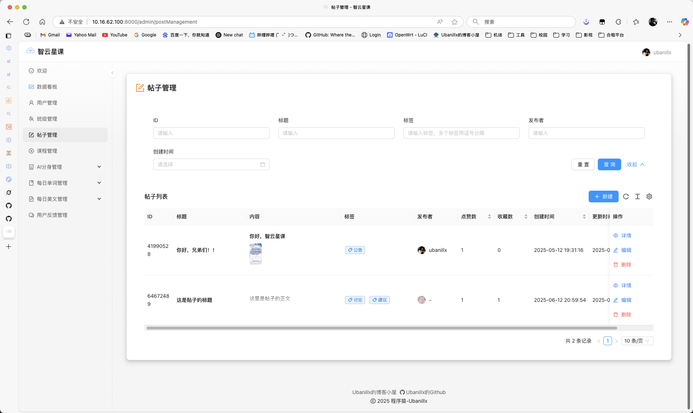
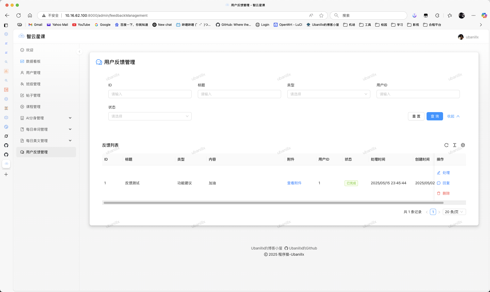

# 智星云课管理系统前端

## 项目简介

智星云课管理系统是一个智能化教育平台的前端管理系统，基于React、Ant Design Pro和Umi框架开发。该系统提供了丰富的数据可视化功能，用于监控和分析教育平台的运营情况，包括用户活跃度、课程完成率、班级活跃度等关键指标，帮助教育机构实时掌握平台运营数据，优化教学效果。

作为一个完整的教育管理平台，智星云课系统整合了课程管理、用户管理、学习资源管理和社区互动等多个功能模块，为教育机构提供一站式数字化解决方案。系统采用现代化前端架构，支持响应式设计，确保在各种设备上都能提供良好的用户体验。

平台的数据分析功能深度整合了ECharts图表库，实现了多维度的数据可视化展示，帮助教育管理者从宏观和微观两个层面理解平台运营状况。系统还支持国际化，可根据需求切换中英文界面，满足不同地区用户的需求。

智星云课前端管理系统采用模块化的设计理念，各功能模块高度解耦，便于维护和扩展。系统使用TypeScript进行开发，提供了类型安全保障，有效减少开发过程中的错误。前端与后端通过RESTful API进行通信，支持OpenAPI规范，便于接口管理和文档生成。

## 系统界面概览

### 主界面


系统主界面采用了现代化的设计风格，集成了侧边导航栏、面包屑导航、以及清晰的内容区域布局。界面设计遵循Ant Design规范，保证了良好的用户体验和视觉一致性。

## 技术栈

- **框架**: React 18, UmiJS 4.x, Ant Design Pro
- **UI组件库**: Ant Design 5.x
- **数据可视化**: ECharts 5.x
- **类型检查**: TypeScript 4.x
- **状态管理**: Umi Max内置状态管理
- **构建工具**: Max CLI (基于UmiJS)
- **样式解决方案**: Less, CSS-in-JS (Emotion)
- **网络请求**: Axios, useRequest
- **国际化**: i18n
- **测试工具**: Jest
- **代码规范**: ESLint, Prettier
- **文档生成**: OpenAPI

## 系统特点

- **响应式设计**: 适配各种屏幕尺寸，提供一致的用户体验
- **模块化架构**: 功能模块高度解耦，便于维护和扩展
- **数据驱动**: 丰富的数据可视化展示，支持实时监控和分析
- **权限管理**: 细粒度的权限控制系统，保障数据安全
- **主题定制**: 支持明暗主题切换，可自定义主题色彩
- **国际化**: 支持中英文界面切换，满足不同地区用户需求
- **Mock数据**: 内置Mock数据服务，支持离线开发和测试
- **性能优化**: 路由级代码分割、图片懒加载、组件按需加载
- **SEO友好**: 预渲染和服务端渲染支持，提升搜索引擎索引效率
- **容器化部署**: 提供Docker配置，支持容器化部署

## 功能模块

### 数据看板



数据看板是系统的核心功能之一，提供了全面的数据监控和分析能力：

- **统计概览**：总用户数、活跃用户、班级总数、帖子总数、课程总数等关键指标的实时统计
- **用户分析**：用户活跃度趋势、周内学习时段分布热力图、学习时长分布等多维度用户行为分析
- **课程分析**：课程完成率、热门课程排行、学习进度统计等课程相关数据分析
- **班级分析**：班级活跃度排名、学科分布分析、学科成绩分布等班级管理数据



系统支持多种图表类型展示数据：
- **折线图**：展示用户活跃度趋势等时间序列数据
- **饼图/环形图**：展示学习时长分布等比例数据
- **柱状图**：展示课程完成率等对比数据
- **雷达图**：展示学科学习情况等多维度评估
- **热力图**：展示周内学习时段分布等热度数据

### 用户管理



用户管理模块提供了完整的用户生命周期管理功能：

- **学生账户管理**：学生信息的增删改查、学习进度跟踪、成绩管理
- **教师账户管理**：教师信息管理、教学权限分配、课程分配
- **用户权限控制**：基于角色的权限管理系统，支持细粒度权限控制
- **批量操作**：支持用户信息的批量导入导出、批量权限设置
- **用户统计**：用户注册趋势、活跃度分析、学习行为统计

### 课程管理
- 课程内容管理
- 课程章节管理
- 课程材料管理
- 课程评价管理

### 学习资源

#### 单词库管理


单词库管理功能为语言学习提供了强大的词汇管理工具：

- **词汇录入**：支持单个词汇录入和批量导入
- **词汇分类**：按学科、难度、主题等多维度分类管理
- **例句管理**：为每个词汇添加例句和使用场景
- **发音管理**：集成语音合成和录音功能
- **学习进度跟踪**：统计词汇学习情况和掌握程度

#### 每日美文管理


每日美文管理模块用于管理学习素材和阅读资源：

- **文章发布**：支持富文本编辑、图片插入、格式设置
- **内容分类**：按主题、难度、类型等多维度分类
- **推荐算法**：基于用户兴趣和学习水平推荐合适内容
- **阅读统计**：统计文章阅读量、用户反馈、学习效果

#### AI分身助教管理


AI分身助教功能为个性化学习提供了智能化支持：

- **分身创建**：创建个性化的AI助教角色
- **知识库管理**：为AI分身配置专业知识和回答库
- **对话管理**：管理AI分身与学生的对话记录
- **性格设定**：为AI分身设定不同的教学风格和性格特点



分身使用统计功能提供了详细的使用分析：

- **使用频率统计**：统计各AI分身的使用频率和受欢迎程度
- **对话质量分析**：分析对话内容质量和用户满意度
- **学习效果评估**：评估AI分身对学习效果的帮助程度
- **性能优化建议**：基于数据分析提供优化建议

### 社区互动

#### 帖子管理


社区互动模块促进了学习者之间的交流和互动：

- **帖子审核**：支持帖子的发布、编辑、删除和审核
- **内容分类**：按学科、话题、类型等多维度分类管理
- **互动统计**：统计帖子的点赞、收藏、回复等互动数据
- **违规处理**：自动识别和处理违规内容
- **精华推荐**：推荐优质内容到首页和推荐位

#### 用户反馈管理


用户反馈管理确保了系统的持续改进和用户满意度：

- **反馈收集**：多渠道收集用户反馈和建议
- **问题分类**：按类型、紧急程度、影响范围等分类处理
- **处理流程**：建立完整的反馈处理流程和跟踪机制
- **满意度调查**：定期进行用户满意度调查和分析
- **改进建议**：基于反馈数据提供系统改进建议

## 项目结构

```
smartclass-manage-frontend/
├── config/                 # 配置文件目录
│   ├── config.ts          # 全局配置文件
│   ├── defaultSettings.ts # 默认设置配置
│   ├── oneapi.json        # OpenAPI配置
│   ├── proxy.ts           # 代理配置
│   └── routes.ts          # 路由配置
├── doc/                   # 文档和截图目录
│   ├── 主页.png           # 系统主界面截图
│   ├── 数据看板.png       # 数据看板界面截图
│   ├── 数据看板二.png     # 数据看板详细视图截图
│   ├── 用户管理.png       # 用户管理界面截图
│   ├── 帖子管理.png       # 帖子管理界面截图
│   ├── 分身管理.png       # AI分身管理界面截图
│   ├── 分身使用统计.png   # AI分身统计界面截图
│   ├── 单词管理.png       # 单词管理界面截图
│   ├── 文章管理.png       # 文章管理界面截图
│   └── 用户反馈.png       # 用户反馈界面截图
├── mock/                  # Mock数据目录
│   ├── listTableList.ts   # 表格列表Mock数据
│   ├── notices.ts         # 通知Mock数据
│   ├── requestRecord.mock.js # 请求记录Mock数据
│   ├── route.ts           # 路由Mock数据
│   └── user.ts            # 用户Mock数据
├── public/                # 静态资源目录
│   ├── admin/             # 管理员相关静态资源
│   ├── icons/             # 图标文件
│   ├── scripts/           # 脚本文件
│   ├── favicon.ico        # 网站图标
│   ├── logo.svg           # 系统Logo
│   └── pro_icon.svg       # Pro版本图标
├── src/                   # 源代码目录
│   ├── access.ts          # 权限配置
│   ├── app.tsx            # 应用入口配置
│   ├── global.less        # 全局样式
│   ├── global.tsx         # 全局脚本
│   ├── assets/            # 静态资源文件
│   │   └── logo.svg       # 资源Logo
│   ├── components/        # 公共组件
│   │   ├── Footer/        # 页脚组件
│   │   ├── HeaderDropdown/ # 头部下拉组件
│   │   ├── RightContent/  # 右侧内容组件
│   │   └── index.ts       # 组件导出文件
│   ├── constants/         # 常量定义
│   │   ├── constants.ts   # 通用常量
│   │   ├── enums.ts       # 枚举定义
│   │   └── index.ts       # 常量导出
│   ├── locales/           # 国际化资源
│   │   ├── zh-CN/         # 中文语言包
│   │   │   ├── component.ts  # 组件国际化
│   │   │   ├── globalHeader.ts # 全局头部国际化
│   │   │   ├── menu.ts    # 菜单国际化
│   │   │   ├── pages.ts   # 页面国际化
│   │   │   ├── pwa.ts     # PWA国际化
│   │   │   └── settingDrawer.ts # 设置抽屉国际化
│   │   ├── zh-TW/         # 繁体中文语言包
│   │   ├── en-US/         # 英文语言包
│   │   ├── ja-JP/         # 日文语言包
│   │   ├── ko-KR/         # 韩文语言包
│   │   ├── pt-BR/         # 葡萄牙语语言包
│   │   ├── ru-RU/         # 俄语语言包
│   │   └── fa-IR/         # 波斯语语言包
│   ├── pages/             # 页面组件
│   │   ├── DataPanel.tsx  # 数据看板页面
│   │   ├── Welcome.tsx    # 欢迎页面
│   │   ├── Admin/         # 管理员相关页面
│   │   │   ├── UserManager/ # 用户管理页面
│   │   │   ├── PostManager/ # 帖子管理页面
│   │   │   └── FeedbackManager/ # 反馈管理页面
│   │   └── User/          # 用户相关页面
│   │       ├── Login/     # 登录页面
│   │       └── Settings/  # 设置页面
│   ├── services/          # API服务
│   │   ├── backend/       # 后端API接口定义
│   │   │   ├── userController.ts # 用户控制器API
│   │   │   ├── postController.ts # 帖子控制器API
│   │   │   └── dataController.ts # 数据控制器API
│   │   ├── swagger/       # Swagger生成的API
│   │   │   ├── index.ts   # API索引文件
│   │   │   └── typings.d.ts # API类型定义
│   │   └── ant-design-pro/ # Ant Design Pro服务
│   │       ├── api.ts     # 通用API服务
│   │       └── typings.d.ts # 服务类型定义
│   ├── types/             # 类型定义
│   │   └── index.d.ts     # 全局类型定义
│   ├── utils/             # 工具函数
│   │   └── index.ts       # 工具函数导出
│   ├── e2e/               # E2E测试
│   │   └── baseLayout.e2e.ts # 基础布局E2E测试
│   ├── requestErrorConfig.ts # 请求错误配置
│   └── loading.tsx        # 加载组件
├── tests/                 # 测试文件
│   └── setupTests.jsx     # 测试设置
├── types/                 # 全局类型定义
│   ├── cache/             # 缓存相关类型
│   │   ├── @types/        # 类型定义
│   │   └── tsconfig.json  # TypeScript缓存配置
│   └── index.d.ts         # 全局类型导出
├── .dockerignore          # Docker忽略文件
├── .eslintrc.js           # ESLint配置
├── .gitignore             # Git忽略文件
├── .prettierrc            # Prettier配置
├── .stylelintrc.js        # StyleLint配置
├── .umirc.ts              # UmiJS配置
├── biome.json             # Biome配置
├── docker-compose.yml     # Docker Compose配置
├── docker-compose.frontend-only.yml # 仅前端Docker配置
├── Dockerfile             # Docker镜像构建文件
├── jest.config.ts         # Jest测试配置
├── nginx.conf             # Nginx配置文件
├── package.json           # 项目依赖配置
├── tsconfig.json          # TypeScript配置
├── tailwind.config.js     # Tailwind CSS配置
└── yarn.lock              # Yarn锁定文件
```

### 目录结构说明

#### 配置文件（config/）
- **config.ts**: 应用的全局配置，包括API地址、主题设置、功能开关等
- **defaultSettings.ts**: 默认的界面设置，如侧边栏折叠、主题色等
- **oneapi.json**: OpenAPI接口文档配置，用于自动生成API类型
- **proxy.ts**: 开发环境的代理配置，用于解决跨域问题
- **routes.ts**: 应用的路由配置，定义页面路径和权限

#### 源代码（src/）
- **access.ts**: 权限控制逻辑，定义不同角色的访问权限
- **app.tsx**: 应用的根组件配置，包括全局Layout、错误处理等
- **global.less**: 全局样式定义，覆盖Ant Design默认样式
- **global.tsx**: 全局脚本，处理应用初始化逻辑

#### 页面组件（src/pages/）
- **DataPanel.tsx**: 数据看板页面，展示各种统计图表和关键指标
- **Welcome.tsx**: 系统欢迎页面，提供快速导航和系统概览
- **Admin/**: 管理员功能页面，包括用户管理、内容管理等
- **User/**: 普通用户功能页面，包括个人设置、个人信息等

#### 服务层（src/services/）
- **backend/**: 后端API接口定义，使用OpenAPI规范
- **swagger/**: 自动生成的API接口和类型定义
- **ant-design-pro/**: Ant Design Pro内置的服务和工具

#### 国际化（src/locales/）
支持8种语言的国际化配置：
- 中文（简体/繁体）
- 英语
- 日语
- 韩语
- 葡萄牙语
- 俄语
- 波斯语

## 环境要求

- Node.js >= 18.0.0
- yarn 包管理器

## 安装与运行

### 安装依赖

```bash
# 使用yarn
yarn install
```

### 开发模式

```bash
# 开发环境启动
yarn start:dev

# 无mock数据启动
yarn start:no-mock

# 测试环境启动
yarn start:test

# 预发布环境启动
yarn start:pre
```

### 构建与部署

```bash
# 构建生产环境
yarn build

# 预览构建结果
yarn preview

# 分析构建结果
yarn analyze
```

## Docker部署

项目已配置Docker相关文件，支持容器化部署。

### 文件说明

- `Dockerfile`: 用于构建前端应用的Docker镜像，基于Node.js 18和Nginx
- `nginx.conf`: Nginx配置文件，用于静态文件服务和API代理
- `docker-compose.yml`: Docker Compose配置文件，包含前端和后端服务
- `docker-compose.frontend-only.yml`: 仅包含前端服务的Docker Compose配置文件
- `.dockerignore`: 排除不需要复制到Docker镜像中的文件

### 部署方式

#### 方式一：完整部署（前端+后端）

如果你已经有了后端服务的Docker镜像，可以使用此方式部署：

```bash
# 启动服务
docker-compose up -d

# 查看日志
docker-compose logs -f
```

注意：需要先确保后端服务的Docker镜像已经构建好，并且修改`docker-compose.yml`中的`api`服务配置。

#### 方式二：仅部署前端

如果你只想部署前端服务，可以使用此方式：

```bash
# 启动服务
docker-compose -f docker-compose.frontend-only.yml up -d

# 查看日志
docker-compose -f docker-compose.frontend-only.yml logs -f
```

注意：需要修改`docker-compose.frontend-only.yml`中的`API_URL`环境变量，指向真实的后端API地址。

### 自定义Docker配置

#### 修改API地址

在`docker-compose.yml`或`docker-compose.frontend-only.yml`中修改`API_URL`环境变量：

```yaml
environment:
  - API_URL=http://你的后端地址:端口
```

#### 修改端口映射

默认前端服务映射到主机的80端口，如需修改，请在docker-compose文件中更改：

```yaml
ports:
  - "新端口:80"
```

## 代码规范

项目使用ESLint和Prettier进行代码格式化和质量检查：

```bash
# 代码检查
yarn lint

# 自动修复代码问题
yarn lint:fix

# 代码格式化
yarn prettier
```

## 数据可视化功能

系统集成了多种数据可视化图表：

- 折线图：展示用户活跃度趋势等时间序列数据
- 饼图/环形图：展示学习时长分布等比例数据
- 柱状图：展示课程完成率等对比数据
- 雷达图：展示学科学习情况等多维度评估
- 热力图：展示周内学习时段分布等热度数据
- 玫瑰图：展示学科成绩分布等极坐标数据

## 系统架构

### 前端架构设计

系统采用现代化的前端架构设计，遵循以下设计原则：

#### 分层架构
```
┌─────────────────────────────────────┐
│           用户界面层 (UI Layer)        │
│  ┌─────────────┐ ┌─────────────────┐  │
│  │   页面组件   │ │   公共组件库     │  │
│  └─────────────┘ └─────────────────┘  │
├─────────────────────────────────────┤
│          业务逻辑层 (Logic Layer)      │
│  ┌─────────────┐ ┌─────────────────┐  │
│  │   状态管理   │ │    业务逻辑     │  │
│  └─────────────┘ └─────────────────┘  │
├─────────────────────────────────────┤
│          数据访问层 (Data Layer)       │
│  ┌─────────────┐ ┌─────────────────┐  │
│  │   API服务   │ │    数据缓存     │  │
│  └─────────────┘ └─────────────────┘  │
└─────────────────────────────────────┘
```

#### 组件化设计
- **原子组件**: 最基础的UI组件，如按钮、输入框等
- **分子组件**: 由原子组件组合而成的功能组件
- **有机体组件**: 复杂的业务组件，包含完整的业务逻辑
- **模板组件**: 页面级别的布局组件
- **页面组件**: 完整的页面，组合各种组件实现业务功能

### 技术选型说明

#### 核心框架选择
- **React 18**: 利用并发特性提升用户体验，支持Suspense和并发渲染
- **UmiJS 4.x**: 提供完善的开发生态，内置路由、构建、部署等功能
- **Ant Design Pro**: 企业级UI解决方案，提供丰富的组件和最佳实践

#### 状态管理策略
- **局部状态**: 使用React Hooks进行组件内状态管理
- **全局状态**: 使用Umi Max内置的状态管理解决方案
- **服务端状态**: 使用SWR进行数据缓存和同步

#### 样式解决方案
- **Less**: 主要的样式预处理器，支持变量、嵌套等高级特性
- **CSS-in-JS**: 使用Emotion进行动态样式处理
- **主题系统**: 支持明暗主题切换和自定义主题配置

## 开发规范

### 代码风格规范

#### TypeScript规范
```typescript
// 接口定义使用PascalCase
interface UserInfo {
  id: number;
  name: string;
  email: string;
}

// 类型别名使用PascalCase
type ApiResponse<T> = {
  code: number;
  data: T;
  message: string;
};

// 常量使用UPPER_SNAKE_CASE
const API_BASE_URL = 'https://api.example.com';

// 函数名使用camelCase
const getUserInfo = async (userId: number): Promise<UserInfo> => {
  // 实现逻辑
};
```

#### 组件规范
```typescript
// 组件Props接口定义
interface ComponentProps {
  title: string;
  onClose?: () => void;
}

// 函数组件定义
const MyComponent: React.FC<ComponentProps> = ({ title, onClose }) => {
  // 组件逻辑
  return (
    <div>
      <h1>{title}</h1>
      {onClose && <button onClick={onClose}>关闭</button>}
    </div>
  );
};

export default MyComponent;
```

#### 文件命名规范
- **组件文件**: 使用PascalCase，如`UserManager.tsx`
- **工具函数**: 使用camelCase，如`formatDate.ts`
- **常量文件**: 使用camelCase，如`apiConstants.ts`
- **样式文件**: 使用camelCase，如`userManager.less`

### Git规范

#### 分支管理
- **master**: 主分支，用于生产环境部署
- **develop**: 开发分支，用于日常开发
- **feature/***: 功能分支，用于新功能开发
- **hotfix/***: 修复分支，用于紧急修复
- **release/***: 发布分支，用于版本发布准备

#### 提交信息规范
```
<type>(<scope>): <subject>

<body>

<footer>
```

类型说明：
- **feat**: 新功能
- **fix**: 修复bug
- **docs**: 文档更新
- **style**: 代码格式调整
- **refactor**: 代码重构
- **test**: 测试相关
- **chore**: 构建过程或辅助工具的变动

示例：
```
feat(user): 添加用户头像上传功能

- 实现头像文件选择和预览
- 添加头像压缩和格式转换
- 集成后端头像上传API

Closes #123
```

## 性能优化

### 代码分割
- **路由级分割**: 每个页面独立打包，按需加载
- **组件级分割**: 大型组件使用React.lazy进行懒加载
- **第三方库分割**: 将第三方库单独打包，利用浏览器缓存

### 图片优化
- **格式选择**: 优先使用WebP格式，降级使用JPEG/PNG
- **懒加载**: 实现图片懒加载，减少初始加载时间
- **尺寸适配**: 根据设备像素密度提供不同尺寸的图片

### 缓存策略
- **浏览器缓存**: 静态资源设置合适的缓存策略
- **API缓存**: 使用SWR进行API响应缓存
- **构建缓存**: 利用构建工具的缓存机制加速构建

### 包体积优化
- **Tree Shaking**: 移除未使用的代码
- **按需引入**: Ant Design组件按需引入
- **代码压缩**: 使用Terser进行代码压缩
- **Gzip压缩**: 服务器端启用Gzip压缩

## 部署策略

### 环境配置

#### 开发环境
- **热重载**: 支持代码变更时自动刷新
- **Mock数据**: 提供完整的Mock数据服务
- **调试工具**: 集成React DevTools和Redux DevTools
- **代理配置**: 解决开发环境跨域问题

#### 测试环境
- **自动化测试**: 集成单元测试和E2E测试
- **代码覆盖率**: 生成测试覆盖率报告
- **性能监控**: 监控应用性能指标
- **错误收集**: 自动收集和上报错误信息

#### 生产环境
- **CDN部署**: 静态资源部署到CDN
- **负载均衡**: 多实例部署，提高可用性
- **监控告警**: 实时监控系统状态
- **日志收集**: 收集和分析访问日志

### CI/CD流程

```yaml
# .github/workflows/deploy.yml
name: Deploy
on:
  push:
    branches: [master]

jobs:
  build-and-deploy:
    runs-on: ubuntu-latest
    steps:
      - uses: actions/checkout@v2
      - name: Setup Node.js
        uses: actions/setup-node@v2
        with:
          node-version: '18'
      - name: Install dependencies
        run: yarn install
      - name: Run tests
        run: yarn test
      - name: Build
        run: yarn build
      - name: Deploy
        run: yarn deploy
```


## 后端API接口

系统默认后端API服务地址为：http://10.16.62.100:12345

### API接口规范
- **RESTful设计**: 遵循REST API设计规范
- **统一响应格式**: 使用统一的响应数据格式
- **错误处理**: 标准化的错误码和错误信息
- **版本控制**: 支持API版本管理

### 接口文档
- **OpenAPI规范**: 使用OpenAPI 3.0规范定义接口
- **自动生成**: 基于OpenAPI规范自动生成前端接口代码
- **接口测试**: 提供接口测试工具和示例

## 常见问题

### 开发环境问题
1. **API请求代理问题**: 检查`config/proxy.ts`中的代理配置
2. **构建失败**: 检查Node.js版本(>=18)和yarn版本兼容性
3. **没有数据显示**: 检查后端服务是否正常运行
4. **热重载不工作**: 检查文件监听配置和防火墙设置

### 部署环境问题
1. **Docker构建失败**: 检查Dockerfile和.dockerignore配置
2. **Nginx代理错误**: 检查nginx.conf中的代理配置
3. **静态资源404**: 检查构建产物路径和Nginx配置
4. **API跨域问题**: 检查后端CORS配置

### 性能问题
1. **首屏加载慢**: 检查代码分割和资源优化
2. **图表渲染慢**: 检查ECharts配置和数据量
3. **内存泄漏**: 检查组件卸载时的清理工作
4. **网络请求慢**: 检查API响应时间和缓存策略

## 贡献指南

### 参与贡献
1. Fork项目仓库到个人账户
2. 创建特性分支 (`git checkout -b feature/amazing-feature`)
3. 进行代码开发和测试
4. 提交更改 (`git commit -m 'Add some amazing feature'`)
5. 推送分支 (`git push origin feature/amazing-feature`)
6. 创建Pull Request并描述更改内容

### 代码审查
- **功能完整性**: 确保新功能完整实现并通过测试
- **代码质量**: 遵循项目代码规范和最佳实践
- **性能影响**: 评估更改对系统性能的影响
- **安全考虑**: 检查是否存在安全风险

### 问题反馈
- **Bug报告**: 提供详细的错误信息和复现步骤
- **功能建议**: 描述功能需求和使用场景
- **性能问题**: 提供性能数据和分析结果
- **文档改进**: 指出文档不清晰或错误的地方

